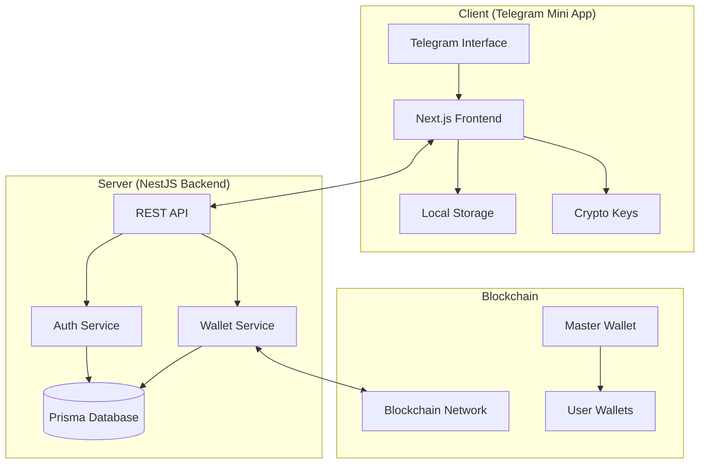
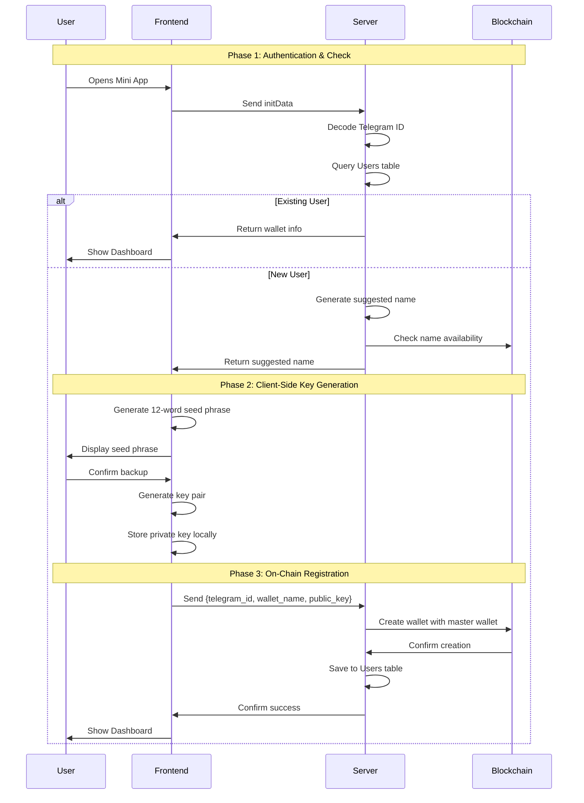

# Design Document: Cedra Quest Wallet Authentication System

## Overview

The Cedra Quest wallet authentication system implements a secure, non-custodial wallet solution for a Telegram Mini App game. The system follows a three-phase architecture: server-side user identification and wallet lookup, client-side cryptographic key generation, and server-facilitated on-chain wallet registration. This design ensures users maintain complete control over their private keys while providing a seamless onboarding experience.

The system leverages Telegram's authentication mechanism for user identification, implements BIP-39 standard for seed phrase generation, and uses a master wallet approach for gas-free initial wallet creation. The architecture prioritizes security through client-side key generation and privacy through minimal server-side data storage.

## Architecture

### High-Level Architecture



### Security Architecture

The system implements a zero-knowledge architecture where the server never has access to user private keys:

- **Client-Side Security**: All cryptographic operations (seed phrase generation, key derivation, private key storage) occur on the user's device
- **Server-Side Security**: Server stores only public information (Telegram IDs, wallet addresses, public keys)
- **Blockchain Security**: On-chain wallets are owned by user public keys, not server keys
- **Communication Security**: All client-server communication uses HTTPS encryption

### Data Flow Architecture



## Components and Interfaces

### Frontend Components (Next.js)

#### AuthenticationManager
```typescript
interface AuthenticationManager {
  initializeTelegramAuth(): Promise<InitData>
  checkExistingUser(initData: InitData): Promise<UserStatus>
  handleExistingUser(userInfo: UserInfo): void
  initiateRegistration(): Promise<void>
}

interface InitData {
  telegram_id: string
  username?: string
  first_name?: string
  auth_date: number
  hash: string
}

interface UserStatus {
  exists: boolean
  userInfo?: UserInfo
  suggestedName?: string
}
```

#### WalletCreationManager
```typescript
interface WalletCreationManager {
  generateSeedPhrase(): string[]
  displaySeedPhrase(words: string[]): Promise<boolean>
  confirmSeedPhraseBackup(): Promise<boolean>
  generateKeyPair(seedPhrase: string[]): KeyPair
  storePrivateKey(privateKey: string): void
  createWallet(walletData: WalletCreationData): Promise<WalletCreationResult>
}

interface KeyPair {
  privateKey: string
  publicKey: string
}

interface WalletCreationData {
  telegram_id: string
  requested_address: string
  public_key: string
}
```

#### WalletRecoveryManager
```typescript
interface WalletRecoveryManager {
  validateSeedPhrase(words: string[]): boolean
  recoverKeyPair(seedPhrase: string[]): KeyPair
  findWalletByPublicKey(publicKey: string): Promise<WalletInfo>
  completeRecovery(walletInfo: WalletInfo): void
}
```

### Backend Components (NestJS)

#### AuthenticationService
```typescript
interface AuthenticationService {
  validateTelegramInitData(initData: string): Promise<TelegramUser>
  findExistingUser(telegramId: string): Promise<UserRecord | null>
  generateSuggestedWalletName(telegramUser: TelegramUser): Promise<string>
}

interface TelegramUser {
  id: string
  username?: string
  first_name?: string
}

interface UserRecord {
  telegram_id: string
  wallet_address: string
  public_key: string
  created_at: Date
  balance?: string
}
```

#### WalletService
```typescript
interface WalletService {
  checkWalletNameAvailability(name: string): Promise<boolean>
  createOnChainWallet(walletData: OnChainWalletData): Promise<WalletCreationResult>
  saveUserWalletMapping(mapping: UserWalletMapping): Promise<void>
  findWalletByPublicKey(publicKey: string): Promise<WalletInfo | null>
}

interface OnChainWalletData {
  wallet_address: string
  public_key: string
  owner_telegram_id: string
}

interface WalletCreationResult {
  success: boolean
  transaction_hash?: string
  error?: string
}
```

#### BlockchainService
```typescript
interface BlockchainService {
  checkAddressExists(address: string): Promise<boolean>
  createWalletAccount(address: string, publicKey: string): Promise<TransactionResult>
  getMasterWalletBalance(): Promise<string>
  estimateGasCost(): Promise<string>
}

interface TransactionResult {
  success: boolean
  transaction_hash: string
  gas_used: string
  error?: string
}
```

### Database Schema (Prisma)

```prisma
model User {
  id           String   @id @default(cuid())
  telegram_id  String   @unique
  wallet_address String @unique
  public_key   String
  created_at   DateTime @default(now())
  updated_at   DateTime @updatedAt
  
  @@map("users")
}

model WalletCreationLog {
  id              String   @id @default(cuid())
  telegram_id     String
  wallet_address  String
  transaction_hash String?
  status          String   // 'pending', 'success', 'failed'
  error_message   String?
  created_at      DateTime @default(now())
  
  @@map("wallet_creation_logs")
}
```

## Data Models

### Core Data Models

#### User Profile Model
```typescript
interface UserProfile {
  telegram_id: string
  wallet_address: string
  public_key: string
  balance: string
  created_at: Date
  game_data?: GameProfile
}

interface GameProfile {
  level: number
  experience: number
  achievements: string[]
  last_login: Date
}
```

#### Wallet Model
```typescript
interface Wallet {
  address: string
  public_key: string
  balance: string
  transaction_count: number
  created_at: Date
  is_active: boolean
}
```

#### Authentication Model
```typescript
interface AuthenticationContext {
  telegram_id: string
  session_token: string
  expires_at: Date
  ip_address: string
  user_agent: string
}
```

### Security Models

#### Cryptographic Data Model
```typescript
interface CryptographicData {
  // Client-side only (never transmitted)
  seed_phrase: string[]      // 12 BIP-39 words
  private_key: string        // Derived from seed phrase
  
  // Shared between client and server
  public_key: string         // Derived from private key
  wallet_address: string     // Blockchain address
}
```

#### Error Handling Model
```typescript
interface SystemError {
  code: string
  message: string
  details?: any
  timestamp: Date
  user_friendly_message: string
  retry_possible: boolean
}

interface WalletCreationError extends SystemError {
  phase: 'authentication' | 'generation' | 'blockchain' | 'storage'
  telegram_id?: string
  requested_address?: string
}
```

Now I need to use the prework tool to analyze the acceptance criteria before writing the correctness properties:
## Correctness Properties

*A property is a characteristic or behavior that should hold true across all valid executions of a system-essentially, a formal statement about what the system should do. Properties serve as the bridge between human-readable specifications and machine-verifiable correctness guarantees.*

### Authentication and User Identification Properties

**Property 1: InitData Processing**
*For any* valid Telegram initData, the Authentication System should successfully extract the Telegram ID
**Validates: Requirements 1.1, 1.2**

**Property 2: Authentication Validation**
*For any* initData, the server should correctly validate its authenticity and reject invalid data
**Validates: Requirements 1.3, 1.4**

**Property 3: Authentication Flow Control**
*For any* successfully authenticated user, the system should proceed to wallet lookup
**Validates: Requirements 1.5**

### Existing User Login Properties

**Property 4: User Lookup**
*For any* valid Telegram ID, the server should correctly query the Users table and return appropriate results
**Validates: Requirements 2.1**

**Property 5: Complete Profile Retrieval**
*For any* existing user record, the server should retrieve and return all required profile information (wallet address, balance, etc.)
**Validates: Requirements 2.2, 2.3**

**Property 6: Dashboard Display**
*For any* existing user data received by the frontend, the dashboard should display immediately with correct information
**Validates: Requirements 2.4**

### New User Registration Properties

**Property 7: Registration Initiation**
*For any* Telegram ID not found in the Users table, the server should initiate the registration process
**Validates: Requirements 3.1**

**Property 8: Wallet Name Generation**
*For any* Telegram username or ID, the server should generate a properly formatted suggested wallet name
**Validates: Requirements 3.2, 3.5**

**Property 9: Duplicate Name Handling**
*For any* suggested wallet name that already exists, the server should append numeric suffixes until finding a unique name
**Validates: Requirements 3.3, 3.4**

### Client-Side Cryptographic Properties

**Property 10: BIP-39 Seed Phrase Generation**
*For any* seed phrase generated by the frontend, it should be a valid 12-word BIP-39 mnemonic
**Validates: Requirements 4.1**

**Property 11: Seed Phrase Display and Confirmation**
*For any* generated seed phrase, the frontend should display it with backup instructions and require user confirmation before proceeding
**Validates: Requirements 4.2, 4.3, 4.4**

**Property 12: Key Pair Derivation**
*For any* confirmed seed phrase, the frontend should derive a valid cryptographic key pair
**Validates: Requirements 5.1**

**Property 13: Cryptographic Round Trip**
*For any* valid seed phrase, deriving keys and then regenerating the public key should produce consistent results
**Validates: Requirements 5.1, 8.3**

**Property 14: Private Key Storage**
*For any* generated private key, the frontend should store it securely in LocalStorage and be able to retrieve it
**Validates: Requirements 5.2**

### On-Chain Wallet Creation Properties

**Property 15: Wallet Creation Request**
*For any* wallet creation request, the frontend should send all required fields (Telegram ID, wallet address, public key) to the server
**Validates: Requirements 6.1**

**Property 16: Name Availability Verification**
*For any* wallet creation request, the server should verify name availability before proceeding with blockchain operations
**Validates: Requirements 6.2**

**Property 17: Master Wallet Usage**
*For any* on-chain wallet creation, the server should use the Master Wallet to execute the transaction and pay gas fees
**Validates: Requirements 6.3, 6.6**

**Property 18: Ownership Assignment**
*For any* created wallet, the blockchain should assign ownership to the correct public key provided by the user
**Validates: Requirements 6.4**

**Property 19: Database Persistence**
*For any* successful wallet creation, the server should save the Telegram ID to wallet address mapping in the Users table
**Validates: Requirements 6.5**

### Race Condition and Error Handling Properties

**Property 20: Concurrent Request Handling**
*For any* set of simultaneous wallet creation requests for the same address, the server should process them sequentially and only allow one to succeed
**Validates: Requirements 7.1**

**Property 21: Conflict Error Handling**
*For any* wallet creation that fails due to name conflict, the server should return an appropriate error and the client should automatically retry with a new name
**Validates: Requirements 7.2, 7.3, 7.4**

**Property 22: Persistent Retry Behavior**
*For any* name conflict scenario, the system should continue retrying with incremented suffixes until successful creation
**Validates: Requirements 7.5**

### Wallet Recovery Properties

**Property 23: Recovery Interface**
*For any* wallet recovery request, the frontend should provide an interface for entering a 12-word seed phrase
**Validates: Requirements 8.1**

**Property 24: Seed Phrase Validation**
*For any* entered seed phrase, the frontend should validate it against BIP-39 standards before proceeding
**Validates: Requirements 8.2**

**Property 25: Wallet Recovery by Public Key**
*For any* valid seed phrase, the system should be able to recalculate the public key and locate the associated wallet
**Validates: Requirements 8.4, 8.5**

### Error Handling and User Experience Properties

**Property 26: User-Friendly Error Messages**
*For any* system error, the frontend should display clear, user-friendly messages while logging detailed technical information
**Validates: Requirements 10.1, 10.5**

**Property 27: Error Classification**
*For any* blockchain operation failure, the system should correctly distinguish between temporary and permanent failures
**Validates: Requirements 10.2**

**Property 28: Retry Options**
*For any* recoverable network error, the system should provide appropriate retry options to the user
**Validates: Requirements 10.3**

**Property 29: Technical Detail Filtering**
*For any* error displayed to users, technical details should be filtered out while maintaining helpful guidance
**Validates: Requirements 10.4**

## Error Handling

### Error Categories

#### Authentication Errors
- **Invalid InitData**: Malformed or tampered Telegram authentication data
- **Expired Session**: Authentication data beyond valid time window
- **Missing Telegram ID**: InitData missing required user identification

#### Wallet Creation Errors
- **Name Conflict**: Requested wallet address already exists
- **Blockchain Failure**: On-chain transaction fails or times out
- **Insufficient Gas**: Master wallet lacks funds for transaction fees
- **Invalid Public Key**: Malformed or invalid cryptographic key provided

#### Recovery Errors
- **Invalid Seed Phrase**: Seed phrase fails BIP-39 validation
- **Wallet Not Found**: No wallet associated with recovered public key
- **Key Derivation Failure**: Unable to derive keys from seed phrase

#### System Errors
- **Database Unavailable**: Database connection or query failures
- **Network Timeout**: Communication failures between components
- **Rate Limiting**: Too many requests from single user/IP

### Error Handling Strategies

#### Client-Side Error Handling
```typescript
interface ErrorHandler {
  handleAuthenticationError(error: AuthError): void
  handleWalletCreationError(error: WalletError): void
  handleRecoveryError(error: RecoveryError): void
  displayUserFriendlyMessage(error: SystemError): void
  logTechnicalDetails(error: SystemError): void
}
```

#### Server-Side Error Handling
```typescript
interface ServerErrorHandler {
  validateRequest(request: any): ValidationResult
  handleDatabaseError(error: DatabaseError): ErrorResponse
  handleBlockchainError(error: BlockchainError): ErrorResponse
  logSecurityEvent(event: SecurityEvent): void
}
```

#### Retry Logic
- **Exponential Backoff**: For temporary network failures
- **Immediate Retry**: For name conflicts with automatic suffix generation
- **User-Initiated Retry**: For blockchain failures and timeouts
- **Circuit Breaker**: For repeated system failures

## Testing Strategy

### Dual Testing Approach

The testing strategy employs both unit testing and property-based testing to ensure comprehensive coverage:

- **Unit Tests**: Verify specific examples, edge cases, and error conditions
- **Property Tests**: Verify universal properties across all inputs
- **Integration Tests**: Verify component interactions and end-to-end flows

### Property-Based Testing Configuration

**Testing Library**: Use `fast-check` for TypeScript/JavaScript property-based testing
**Test Configuration**: Minimum 100 iterations per property test
**Test Tagging**: Each property test must reference its design document property

Tag format: `Feature: cedra-quest-wallet-auth, Property {number}: {property_text}`

### Unit Testing Focus Areas

#### Authentication Module
- Telegram initData parsing with various formats
- Authentication validation with valid/invalid signatures
- Error handling for malformed requests

#### Wallet Creation Module
- BIP-39 seed phrase generation and validation
- Key pair derivation from seed phrases
- Name conflict resolution with suffix generation

#### Blockchain Integration
- Master wallet transaction execution
- Gas fee calculation and payment
- On-chain wallet ownership verification

#### Database Operations
- User record creation and retrieval
- Concurrent access handling
- Data integrity validation

### Property Testing Focus Areas

#### Cryptographic Properties
- **Seed Phrase Validity**: All generated seed phrases are valid BIP-39
- **Key Derivation Consistency**: Same seed phrase always produces same keys
- **Round Trip Integrity**: Seed phrase → keys → recovery maintains consistency

#### Business Logic Properties
- **Name Uniqueness**: No two users can have the same wallet address
- **Ownership Integrity**: Created wallets are always owned by correct public key
- **Data Persistence**: Successful operations always result in correct database state

#### Error Handling Properties
- **Graceful Degradation**: System handles all error conditions without crashing
- **User Experience**: Error messages are always user-friendly and actionable
- **Security**: No sensitive data is exposed in error responses

### Integration Testing

#### End-to-End Flows
1. **New User Registration**: Complete flow from Telegram auth to wallet creation
2. **Existing User Login**: Authentication and dashboard display
3. **Wallet Recovery**: Seed phrase entry to wallet restoration
4. **Error Recovery**: Name conflicts and automatic retry

#### Performance Testing
- Authentication response time under load
- Concurrent wallet creation handling
- Database query performance with large user base

#### Security Testing
- InitData validation against tampering
- Private key isolation verification
- HTTPS communication enforcement